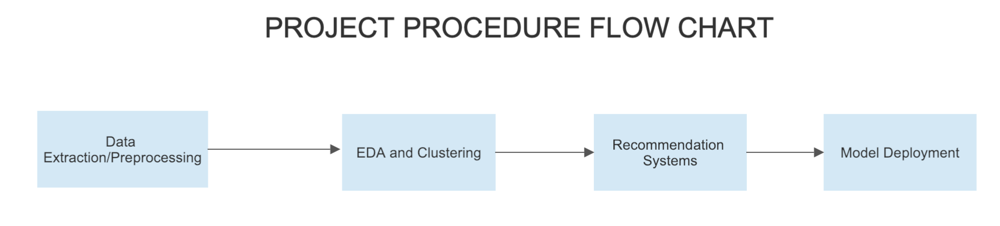
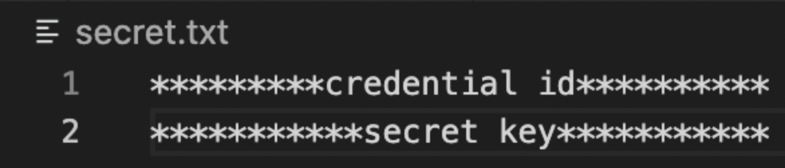

# Get Relevant Spotify Playlists with Machine Learning:Spotify Song Recommendation System


## Introduction

The goal of this project is to recommend songs for a given playlist. This project starts from data collection all the way to model deployment to ensure you have a working model to showcase.

## Built with
Python
Css
Html
Flask

## How to use 
To clone the repository use:
```sh
git lfs clone https://github.com/VivekDahiya10/SpotifyRecommendationSystem.git
```

## Process

The following image is the flow chart of the project:


### Data extraction

Here are a couple of things you should know before starting the project.

#### Spotfiy API Acquisition
Spotify Api is an awesome tool which can be used to perform a number of taks.Some pf them are audio features extraction,audio analysis,getting metadata,searching and editing playlists.Just in case that you haven't used an API previously, the utilisation of different keys for verification, and the sending of request can end up being a bit overwhelming. First we'll get  keys to use. For this, we want a [Spotify for developers] (https://developer.spotify.com/) account. This is same as a Spotify account, and doesn't need Spotify Premium. From here, go to the dashboard and "make an application".
#### Spotify Credentials Storage and Access

Since we have an application, we can get a client ID and a client secret for this application. Both of these will be required to authenticate with the Spotify web API for our application, and can be considered a sort of username and secret key for the application. It is best practice not to share both of these, but rather particularly don't share the client secret key.We can keep it in a different document, which, if you're using Git for version control, should  be Gitignored.

Spotify credentials should be stored in a `secret.txt` file with the first line as the **credential id** and the second line as the **secret key**:




Secret Credentials can be accessed using the following code:

```python
with open("secret.txt") as f:
    secret_ls = f.readlines()
    cid = secret_ls[0][:-2]
    secret = secret_ls[1]
```

### EDA and clustering

### Recommendation Model
The recommendation model is summarized in the `content_based_recsys.ipynb` notebook. In this section, we will go through the process of building a content-based filtering recommendation. The following parts will be covered:

1. Package Setup
2. Preprocessing
3. Feature Generation
4. Content-based Filtering Recommendation

Please follow the instruction to produce the result.

### Deployment

To test the full functionality of the model, please, download the repository data, cd into the folder and run the following commands:
```sh
cd recommendation_app
python wsgi.py
```
Then visit the local host and try out the model using any playlist!

To create a virtual environment, you can run the following commands:
```sh
python3 -m venv venv
source venv/bin/activate (or venv\Scripts\activate if you are using Windows)
```
Installing dependencies in virtual environment:
```
pip3 install -r requirements.txt
```

## Repo Structure
```
│
├── README.md          <- The top-level README for developers using this project.
├── data
│   ├── raw            <- The original, immutable data dump.
│   ├── processed      <- The preprocessed data sets for training.
│   ├── test           <- The test data sets for testing.
│   └── final          <- The final data sets for modeling.
│
├── models             <- Trained models, model predictions, or model summaries.
│
├── notebooks          <- Serialized Jupyter notebooks created in the project.
│   ├── script         <- Script for data extraction and loading data
│   ├── Extraction     <- Data extraction using Spotify API
│   ├── EDA            <- Exploratory data analysis process.
│   └── Recsys         <- The training of traditional statistical models.
│
├── recommendation_app <- Model deployment folder
│   ├── application    <- Code for model deployment and website design
│   ├── data1          <- Pretrained data for model
│   └── venv           <- Environment
│
└── requirements.txt   <- The requirements file for reproducing the analysis environment.
```
## Future Scope and Limitations
1. This system has limited number of songs and only in english language.The dataset can be extended to other langauages.
2. This app can be deployed on online hosting platforms.
3. The model can be trained on new inputs that the user enters and the dataset can updated.
4. A larger dataset can be taken in order to get better results in a wide range of genres.
